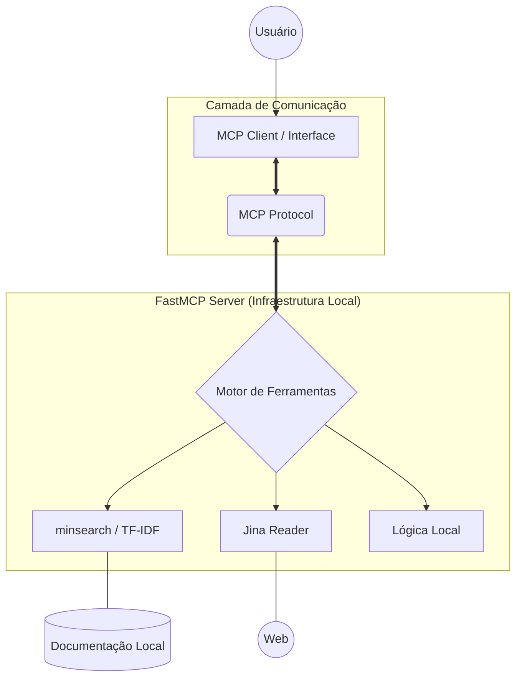
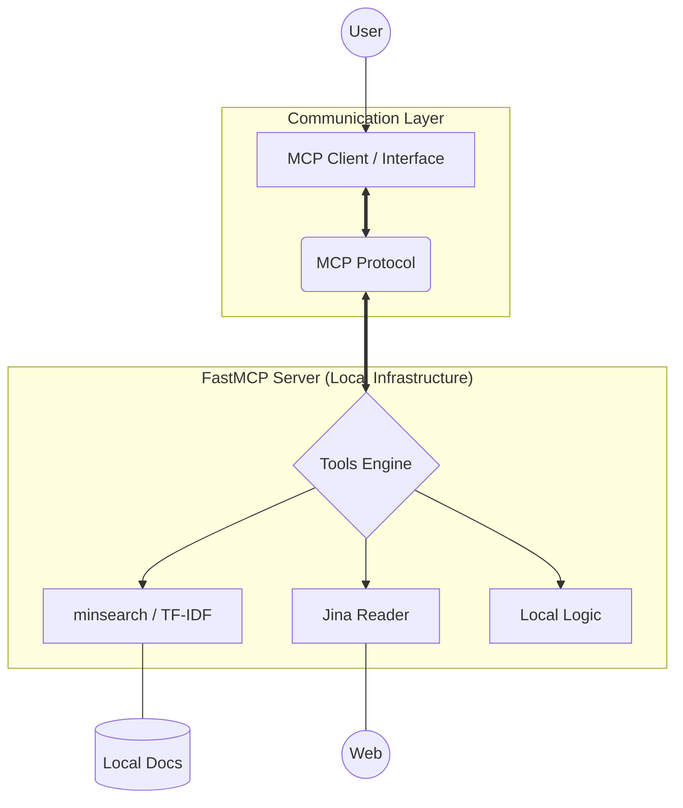

# FastMCP Search Server 🚀

[Português](#português) | [English](#english)

---

## Português

Servidor baseado no protocolo **MCP (Model Context Protocol)** projetado para fornecer uma infraestrutura de **Arquitetura de Acesso + Contexto**. Este sistema permite que Agentes de IA estendam suas capacidades através de ferramentas locais e recuperação de dados especializados sem a necessidade de processamento de LLM no lado do servidor.

### 🏗️ Arquitetura e Funcionamento

O sistema opera como uma camada intermediária de inteligência local, automatizando a busca e o processamento de dados para injetar apenas o necessário na janela de contexto do cliente.



### 🛠️ Ferramentas, Inputs e Outputs

| Ferramenta | Descrição | Input | Output |
| :--- | :--- | :--- | :--- |
| `search_docs` | Busca semântica inteligente usando TF-IDF. | `query` (string) | Lista dos 5 documentos mais relevantes com preview. |
| `scrape_page` | Web scraping otimizado para IA. | `url` (string) | Conteúdo da página em Markdown limpo. |
| `hash_text` | Geração de hash para integridade. | `text` (string) | String SHA-256 hexadecimal. |
| `add` | Operação aritmética precisa. | `a` (int), `b` (int) | Soma literal dos números. |

### 💻 Stack Tecnológica

- **FastMCP**: Framework principal para orquestração do protocolo.
- **minsearch**: Motor de busca minimalista para indexação in-memory.
- **Scikit-learn & Pandas**: Vetorização e manipulação de dados estruturados.
- **Jina Reader API**: Conversão de HTML para Markdown legível por IA.

### 🚀 Instalação

```bash
# Clone o repositório e instale as dependências
uv sync

# Execute o servidor
uv run python main.py
```

---

## English

A server based on the **Model Context Protocol (MCP)** designed to provide an **Architecture of Access + Context**. This system allows AI Agents to extend their capabilities through local tools and specialized data retrieval without the need for LLM processing on the server side.

### 🏗️ Architecture and Workflow

The system operates as an intermediate layer of local intelligence, automating data search and processing to inject only what is necessary into the client's context window.



### 🛠️ Tools, Inputs, and Outputs

| Tool | Description | Input | Output |
| :--- | :--- | :--- | :--- |
| `search_docs` | Intelligent semantic search using TF-IDF. | `query` (string) | List of the 5 most relevant docs with content preview. |
| `scrape_page` | AI-optimized web scraping. | `url` (string) | Page content in clean Markdown. |
| `hash_text` | Hash generation for data integrity. | `text` (string) | SHA-256 hexadecimal string. |
| `add` | Precise arithmetic operation. | `a` (int), `b` (int) | Literal sum of the numbers. |

### 💻 Technical Stack

- **FastMCP**: Core framework for protocol orchestration.
- **minsearch**: Minimalist search engine for in-memory indexing.
- **Scikit-learn & Pandas**: Vectorization and structured data handling.
- **Jina Reader API**: HTML to AI-readable Markdown conversion.

### 🚀 Getting Started

```bash
# Clone the repository and install dependencies
uv sync

# Run the server
uv run python main.py
```

---

## 📝 Conclusão / Conclusion

Este projeto demonstra a viabilidade de construir camadas de suporte para agentes de IA que priorizam a eficiência e a soberania dos dados. Ao utilizar o protocolo MCP, removemos a fricção entre bases de dados locais e modelos globais, garantindo que o contexto injetado seja preciso, relevante e processado de forma otimizada.

This project demonstrates the feasibility of building support layers for AI agents that prioritize efficiency and data sovereignty. By using the MCP protocol, we remove the friction between local databases and global models, ensuring that the injected context is accurate, relevant, and optimally processed.

---
*Developed as part of the AI Dev Bootcamp.*
