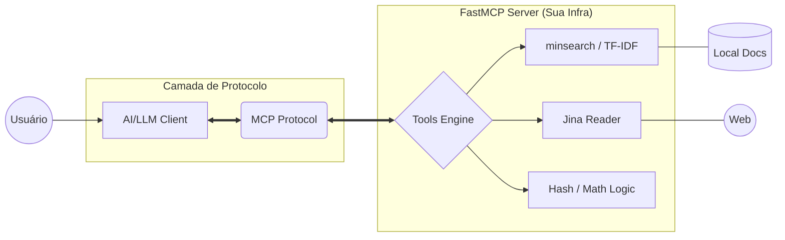

# FastMCP Documentation Search Server 🚀

Este projeto é um servidor **MCP (Model Context Protocol)** de última geração, construído com **FastMCP**. Ele implementa o que chamamos de **Arquitetura do Acesso + Contexto**, focando em fornecer infraestrutura para que Agentes de IA acessem informações técnicas com precisão cirúrgica e custo zero de tokens de processamento local.

---

## � O Que Este Servidor Resolve?

Diferente de sistemas que entopem o contexto da IA com dados desnecessários, este servidor foca no **Just-In-Time Context**. Ele permite que a IA "pergunte" e "valide" informações antes de responder ao usuário, eliminando alucinações técnicas.

**Diferencial Crítico:** Esta aplicação **não utiliza APIs de LLM**. Ela é uma infraestrutura de dados e ferramentas que atua como o "sistema nervoso periférico" do modelo (como Claude ou GPT), garantindo segurança, privacidade e baixo custo.

---

## 🛠️ Ferramentas Disponíveis (Tools)

- **`search_docs(query)`**: Utiliza o motor **minsearch** com indexação **TF-IDF** para encontrar os 5 documentos mais relevantes dentro da documentação do FastMCP (`.md` e `.mdx`).
- **`scrape_page(url)`**: Extrai e limpa o conteúdo de páginas web via **Jina Reader**, entregando apenas o Markdown essencial para a IA.
- **`hash_text(text)`**: Gera um hash SHA-256 local, garantindo integridade de dados sem sair da sua infraestrutura.
- **`add(a, b)`**: Execução lógica pura para cálculos matemáticos precisos, evitando erros de raciocínio do modelo.

---

## 🏗️ Arquitetura e Funcionamento

A arquitetura segue um fluxo de "Smart Data" em vez de "Big Data":

1. **User Request**: O usuário faz uma pergunta técnica via Client (ex: Claude Desktop).
2. **MCP Protocol**: Uma ponte bidirecional conecta o cérebro (LLM) aos músculos (Seu Servidor).
3. **FastMCP Server**: Executa a lógica local e independente (Search, Scraping, Math).
4. **Context Injection**: Apenas a informação lapidada volta para o modelo.

### Diagrama de Fluxo Mermaird:



---

## � Tech Stack

- **FastMCP**: Framework para orquestração rápida de protocolos MCP.
- **minsearch**: Mecanismo de busca minimalista e extremamente eficiente.
- **Scikit-learn & Pandas**: Processamento vetorial e manipulação de dados estruturados.
- **Requests & Zipfile**: Gerenciamento de arquivos e aquisição de dados web.

---

## 🚀 Como Executar

### Pré-requisitos
- Python 3.13+
- [uv](https://github.com/astral-sh/uv)

### Instalação e Execução Local
```bash
uv sync
uv run python main.py
```

### Configuração no Claude Desktop
Adicione ao seu `claude_desktop_config.json`:

```json
{
  "mcpServers": {
    "fastmcp-search": {
      "command": "uv",
      "args": [
        "--directory",
        "SUA_PASTA_DO_PROJETO",
        "run",
        "python",
        "main.py"
      ]
    }
  }
}
```

---
*Desenvolvido como parte do AI Dev Bootcamp por um Engenheiro de IA e Cientista de Dados.*

